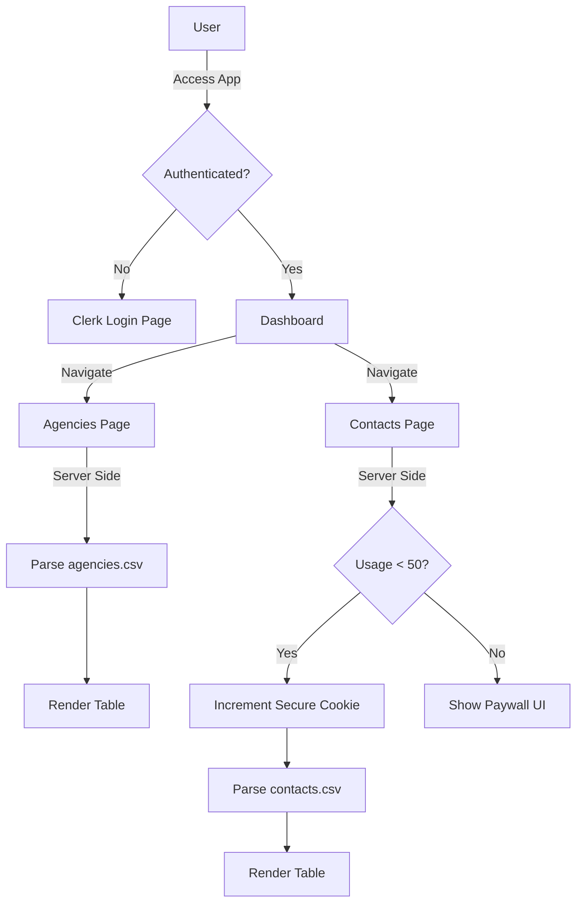

# 🚀 Agency Dashboard — Next.js 16 Application

A modern and secure dashboard built to browse and manage agency and employee contact data.  
This project was developed as a **Take-Home Assignment for a Jr SDE position**.


---

## 📋 Project Overview

The application allows authenticated users to explore a database of government agencies and their associated contacts.  
A core business rule limits each user to **50 contact detail views per day**, simulating a freemium SaaS model.

### 🔑 Key Features
- **🔐 Authentication** — Fully integrated Clerk authentication (Sign in / Sign up / Protected routes).
- **🏢 Agency Directory** — Full access to the list of agencies with search and pagination.
- **👥 Contact Directory** — Employee contact browsing with a **daily usage limit**.
- **⛔ Usage Limiter** — Server-side logic blocks access once **50 contacts/day** have been viewed.
- **💎 Premium-style Paywall** — Displayed when the daily limit is reached.
- **🎨 Modern UI/UX** — Tailwind CSS, glassmorphism effects, and Lucide icons.

---

## 🏗️ System Architecture

The app uses a **server-side first** approach to handle data loading and usage tracking without requiring a full database for this assignment.

### 📊 Data Flow Diagram



---

## ⚙️ Technical Decisions

| Feature | Implementation | Reason |
|--------|----------------|--------|
| **Framework** | Next.js 16 (App Router) | Server Components, performance, file-based routing |
| **Usage Tracking** | Secure Cookies | Lightweight persistence without SQL DB |
| **Data Source** | Local CSV + PapaParse | Simulates a DB while keeping parsing server-side |
| **Styling** | Tailwind CSS | Fast UI development and clean design |

---

## 🚀 Getting Started

Follow the steps below to run the project locally.

### ✅ Prerequisites
- Node.js **18+**
- A **Clerk** account (API keys)

---

### 1. Clone the repository
```bash
git clone https://github.com/mohamedmahrouch/dashboard_app
cd dashboard_app
```

### 2. Install dependencies
```bash
npm install
```

### 3. Environment variables  
Create a `.env.local` file at the root of the project:

```
NEXT_PUBLIC_CLERK_PUBLISHABLE_KEY=pk_test_...
CLERK_SECRET_KEY=sk_test_...
NEXT_PUBLIC_CLERK_SIGN_IN_URL=/sign-in
NEXT_PUBLIC_CLERK_SIGN_UP_URL=/sign-up
```

### 4. Data Setup  
Ensure the `data/` folder contains the following files:

```
data/agencies.csv
data/contacts.csv
```

### 5. Run the app
```bash
npm run dev
```

Open **http://localhost:3000**

---

## 📁 Project Structure

```
src/
├── app/
│   ├── agencies/          # Agency listing with pagination
│   ├── contacts/          # Contact listing + usage limit
│   ├── dashboard/         # Main user dashboard
│   ├── sign-in/           # Clerk authentication pages
│   ├── sign-up/
│   └── layout.tsx         # Root layout with ClerkProvider
│
├── components/
│   └── Navbar.tsx         # Responsive navigation bar
│
├── lib/
│   ├── csv.ts             # Server-side CSV parsing
│   └── limit.ts           # Daily usage limit logic
│
└── middleware.ts          # Route protection + secure cookie handling
```

---

## ☁️ Deployment (Vercel)

1. Push your code to GitHub.  
2. Import it into **Vercel**.  
3. Add the Clerk environment variables in **Project Settings → Environment Variables**.  
4. Deploy.

---

## 👤 Author

**Mohamed Mahrouch**  
Junior Software Development Engineer — Candidate
